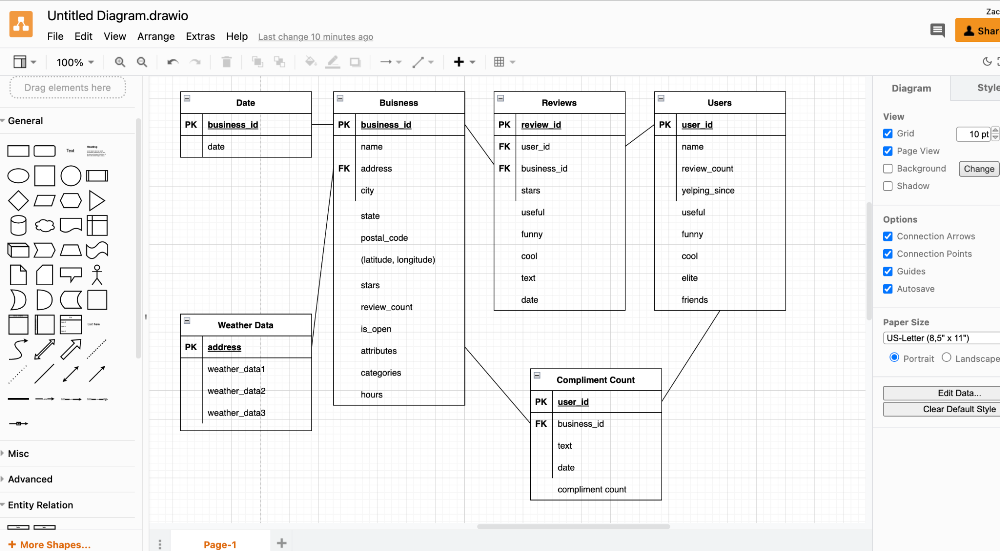
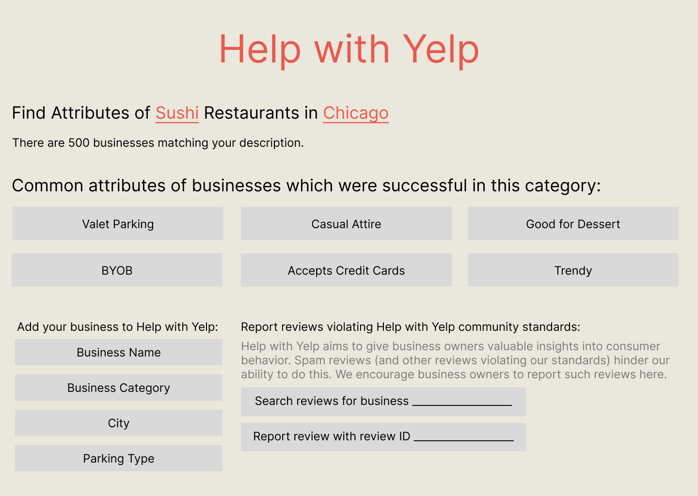

## **Description**

_Description of an application of your choice. State as clearly as possible what you want to do. What problem do you want to solve, etc.?_

Small businesses often fail due to a lack of understanding of customer behavior. However, a wealth of customer data exists; the website Yelp, for example, houses millions of crowd-sourced business reviews. Its customer-centric approach to displaying these reviews limits its utility for businesses. For example, a sushi restaurant in Chicago may want to better understand the behavior of successful sushi restaurants in the area. What is the ambience of these restaurants? Are they open late? Do they have outdoor seating? Currently, it would be both difficult and time-consuming for an individual business owner to parse through this information for every business in its category in the area.

Help with Yelp aims to remedy this; we will offer small businesses a means to gain insights into the factors which correlate with success. Business owners will be able to select the general categories to which their business belongs (e.g. Chicago business, sushi restaurant), and we will use a subset of Yelp customer review data to suggest a business strategy given these categories. Then, by better understanding the needs of their customers, owners can ensure the success of their businesses.

## **Usefulness**

Our application is useful because there is no perfect business; few businesses with a large number of ratings have an average rating of a 5.0 (perfect score) on Yelp. Thus, businesses almost always seek to improve in areas which would allow for a higher rating (to improve the customer satisfaction/“retention rate”, gain new customers, etc.). Businesses must also always balance cost considerations in making these improvements; our tool is also valuable in that it allows owners to gauge the relative importance of possible improvements (based on their bearing in contributing to a high review). We will use techniques like data visualization and machine learning algorithms on data in the same location (as certain locations might have preferences for certain attributes).

Yelp.com and the Yelp mobile application are the most similar existing websites/applications. These tools allow users to view and submit reviews for businesses. They differ from our tool in that they are user-centric; their primary purpose is to allow customers to determine whether to go to a business or use a service. Businesses would not be able to effectively use the Yelp website or mobile app to construct a business model. Doing so would likely involve manually parsing through hundreds of reviews for hundreds of businesses and attempting to find trends. Help with Yelp is business-centric; we help businesses readily see trends in the strategies of similar successful businesses.

## **Realness**

([https://www.kaggle.com/datasets/yelp-dataset/yelp-dataset?select=yelp_academic_dataset_business.json](https://www.kaggle.com/datasets/yelp-dataset/yelp-dataset?select=yelp_academic_dataset_business.json)) 

(https://www.visualcrossing.com/resources/blog/five-easy-weather-api-calls-to-get-the-weather-data-you-need/)

Our data is from the official Yelp dataset above and the weather api referenced above. Kaggle is a dataset hosting platform specializing in providing data for a large number of different projects and from different sources. We are taking a Yelp dataset hosted on Kaggle to build our database. The data is stored in 5 different JSON files each dealing with an aspect of business, user, and review data.

Specifically this data can be broken down into 5 distinct tables. The business table will be the most dense with data about business location, contact information, total number of reviews, attributes, categories and other useful information we can use to group similar businesses together. Another table (users) will let us gather useful information about what type of review a user makes. Some interesting columns include categorizing the reviews made into useful, funny, cool, and elite. This might be used to build a profile for each user depending on their review data. The last significant table is reviews which connects the business and user review tables. This table will have data such as the number of stars, and the category this review falls under. Other than these three tables we have a table for compliments which is another way to connect users to business other than reviews. This will deal with the date, text and complement count each user gives to a business. With this we also were able to pull climate data for each business location. The process lets us choose a wide variety of different climate data so it might be an option to see if certain businesses get better reviews in a certain climate area.

## **Functionality**

Our web application can be used by business owners to find out what makes a business successful in their requested area. (by successful it means an average star rating of 4 or above) This application would return specific attributes that make a restaurant successful (things like certain opening times, whether or not they accept credit cards, etc) to see what things can be emulated for success. Other things that could be returned are some of the most successful restaurants which can be used to query reviews for those specific top restaurants to get more information on what customers like. 

New restaurant owners can add their own business to the database and help remove reviews from the database which are not very constructive to improve the database experience for other users. If businesses have updated statistics, their ratings could have gone up on the official site or they could have added some attributes, they can update their attributes on the website.

_Description of the functionality that your website offers. This is where you talk about what the website delivers. Talk about how a user would interact with the application (i.e. things that one could create, delete, update, or search for). Read the requirements for stages 4 and 5 to see what other functionalities you want to provide to the users. You should include:_

## **UI Mockup**

## **Work Distribution**

_List of the person responsible for which exact functionalities in section 6. Explain how backend systems will be distributed across members. Be as specific as possible as this could be part of the final peer evaluation metrics._

_As far as work distribution goes we will play to all of our strengths. Micheal will lead the react portion as he has prior experience, Zach and Maya will look into machine learning as they are taking a class on different machine learning applications. Vrushhabh will lead backend services using Flask and collection of weather data .  Overall though we will look at splitting the general database setup evenly by setting weekly goals for the group._

_Whenever we meet we try to organize based on deadlines what needs to be done. As a start we will meet once a week with everyone in order to work on either the project of GA’s. At the end of the meeting we will go over what still needs to be done and divide the work as evenly as possible between everyone. To ensure everything gets done we have discord and other modes to contact the other team members and if there is a problem finishing the weekly work the team should be notified so we can meet up to help out or the workload can be adjusted_
